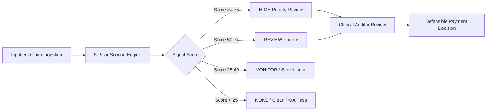

# 🏥 HAC Signal & POA Investigation Engine
### Executive Architecture, Clinical Specification & Demo Presentation Guide

> **Live Environments:**
> * 🌐 **Frontend (Vercel):** [https://poa-hac-ui.vercel.app](https://poa-hac-ui.vercel.app)
> * ⚙️ **Backend API (Render):** [https://poa-hac-backend.onrender.com/api](https://poa-hac-backend.onrender.com/api)
> * 📊 **Live Review Queue:** [https://poa-hac-ui.vercel.app/claims](https://poa-hac-ui.vercel.app/claims)
> * 📈 **Population Analytics:** [https://poa-hac-ui.vercel.app/analytics](https://poa-hac-ui.vercel.app/analytics)

---

## 📑 Table of Contents
1. [Executive Summary & Core Value Proposition](#1-executive-summary--core-value-proposition)
2. [Domain Fundamentals: HAC & POA](#2-domain-fundamentals-hac--poa)
3. [The Golden Rule: Human-Centric Clinical Governance](#3-the-golden-rule-human-centric-clinical-governance)
4. [The 5-Pillar Scoring Engine (Components A–E)](#4-the-5-pillar-scoring-engine-components-ae)
5. [Fairness Suppressors & Regulatory Safeguards](#5-fairness-suppressors--regulatory-safeguards)
6. [Signal Priority Levels](#6-signal-priority-levels)
7. [The 5 Live Demo Cases (Detailed Walkthrough)](#7-the-5-live-demo-cases-detailed-walkthrough)
8. [The 5-Minute High-Impact Demo Script (سيناريو العرض)](#8-the-5-minute-high-impact-demo-script-سيناريو-العرض)
9. [Technical Architecture & Deployment Topology](#9-technical-architecture--deployment-topology)

---

## 1. Executive Summary & Core Value Proposition

In national health insurance systems (e.g., Oman Dhamani, regional health authorities, and private TPAs), **millions of dollars are lost annually paying for avoidable hospital-acquired complications**. 

Hospitals frequently bill payers for the extended stays, reoperations, and high-cost rescue medications necessitated by medical errors or in-hospital infections. Furthermore, verifying whether a complication was pre-existing or acquired during the admission requires hours of manual clinical file audit.

**HAC Signal** is an enterprise-grade clinical auditing engine designed to:
* **Automatically ingest** inpatient claims and longitudinal patient histories.
* **Mathematically calculate an auditable 0–100 Signal Score** using 5 objective clinical criteria.
* **Assemble a transparent Evidence Story** proving when and why a complication occurred.
* **Empower clinical reviewers** to make defensible payment and quality decisions within seconds.



---

## 2. Domain Fundamentals: HAC & POA

### 1. HAC — Hospital-Acquired Complication (المضاعفات المكتسبة بالمستشفى)
An adverse clinical outcome or medical injury that was **not present** when the patient entered the hospital, but occurred during inpatient care. Common examples:
* **Surgical Site Infections (SSI)** (e.g. MRSA infection post-laparotomy).
* **Catheter-Associated Urinary Tract Infections (CAUTI)**.
* **Hospital-Acquired Pressure Injuries** (e.g. Stage 2+ sacral ulcers).
* **Deep Vein Thrombosis & Pulmonary Embolism (DVT/PE)** post-arthroplasty.

### 2. POA — Present On Admission (الحالة الموجودة مسبقاً عند الدخول)
A diagnostic condition that was already diagnosed or established prior to or at the exact moment of emergency/elective admission. 
* If a patient breaks their hip and already has a pressure sore when arriving at the emergency room, the hospital is **not liable** for that sore (POA = Yes).
* If the patient develops that sore 4 days after admission, the hospital is **strictly liable** for quality breakdown.

---

## 3. The Golden Rule: Human-Centric Clinical Governance

> [!IMPORTANT]
> **Fundamental Architectural Invariant:**
> The HAC Signal system **NEVER performs blind automated claim denials or automatic financial penalties**.
> 
> Healthcare clinical decisions carry profound legal and clinical liability. The engine acts strictly as an **intelligent clinical triage and routing mechanism**. It equips the medical auditor with cryptographic audit trails, timestamped evidence cards, and longitudinal history so human judgment remains at the center of the financial decision.

---

## 4. The 5-Pillar Scoring Engine (Components A–E)

The total composite score ($0 \text{ to } 100$) evaluates five independent dimensions:

$$\text{Final Score} = \text{Comp A} + \text{Comp B} + \text{Comp C} + \text{Comp D} + \text{Comp E} \quad (\text{subject to suppressors})$$

```
+-------------------------------------------------------------------------------+
|                        HAC SIGNAL ENGINE (100 PTS MAX)                        |
+---------------------+--------------------+--------------------+---------------+
| Comp A: Coding (20) | Comp B: Timing (20)| Comp C: Path (20)  | Comp D: Rescue| Comp E: Hist  |
| Code Transparency   | POA Inferred Hours | Admission Deviation| Unplanned Proc| Same Provider |
+---------------------+--------------------+--------------------+---------------+---------------+
```

---

### Component A: Cause Transparency of Diagnosis Code (0–20 Points)
*Evaluates what the ICD-10-CM diagnosis code descriptor explicitly confesses about its etiology.*

| Band | Points | Classification Criteria | Clinical Examples |
| :---: | :---: | :--- | :--- |
| **A1** | **20** | **Explicit care event admission** | `T81.4` (Infection following procedure), `J95.` (Post-op respiratory), `K91.` (GI post-op) |
| **A2** | **16** | **Explicit device, implant, or drug** | `T83.5` (Infection from catheter), `T82.` (Vascular graft), `T84.` (Orthopedic implant) |
| **A3** | **12** | **Cause-neutral stand-in for complication** | `A41.` (Sepsis in surgical bed), `L02.` (Cutaneous abscess), `K65.` (Peritonitis) |
| **A4** | **10** | **Acute trigger requiring external event** | `D62` (Acute posthemorrhagic anemia), `S-codes` (Traumatic in-hospital falls) |
| **A5** | **6** | **Complication surveillance list (Silent cause)** | `N17.` (Acute kidney injury), `I26.` (Pulmonary embolism), `L89.` (Pressure sore) |
| **A6** | **0** | **Unclassified / Baseline disease** | Chronic illnesses, benign conditions without surgical linkage |

---

### Component B: In-Stay Timing & Inferred POA (0–20 Points)
*Calculates the exact elapsed hours between inpatient admission and the complication's first clinical detection.*

$$\Delta t = \text{First Observed DateTime} - \text{Admission DateTime}$$

| Band | Elapsed Window | Points | Clinical Interpretation |
| :---: | :---: | :---: | :--- |
| **B1** | **$\ge 48$ Hours** | **20** | **Strong in-stay complication signal.** Clearly passes standard incubation windows. |
| **B2** | **$24 \text{ to } < 48$ Hours**| **12** | **Moderate signal.** Mid-stay manifestation requiring chart audit. |
| **B3** | **$< 24$ Hours** | **6** | **Weak signal.** Early window onset; high likelihood of incubating pre-admission. |
| **B4** | **$\le 0$ Hours (Hour 0)** | **0** | **Confirmed POA.** Present upon emergency intake line; zero complication liability. |

---

### Component C: Clinical Relatedness to Admission (0–20 Points)
*Evaluates whether the complication is an expected natural progression of the primary illness or an unexpected clinical deviation.*

* **Real-Data Safeguard (No Synthetic AI):** Until a certified clinical relationship knowledge graph or calibrated AI pathway model is connected, the engine returns **`UNKNOWN`** and assigns an intermediate baseline (10 points).
* **Audit Rule:** The engine flags `DQ_INFO_UNMAPPED_CLINICAL_RELATIONSHIP` to ensure auditors do **not** mistakenly interpret "Unknown" as "Unrelated".

---

### Component D: Unplanned Intervention Escalation Ladder (0–25 Points)
*Scores what emergency measures the facility had to mobilize to salvage the patient.*

| Category | Base Pts | Mandatory Triggers |
| :--- | :---: | :--- |
| **Return to Theatre** | **25** | Unplanned reopening of laparotomy, wound washout, debridement, surgical revision. |
| **High-Acuity Rescue** | **20** | ICU transfer, invasive mechanical ventilation, emergency hemodialysis, vasopressor drip. |
| **Unplanned Operation**| **14** | Secondary non-diagnostic surgery performed without prior admission scheduling. |
| **Imaging / Diagnostics**| **8** | Specialized CTPA, MRI, diagnostic endoscopy confirming complication. |
| **No Intervention** | **0** | Conservative observation only. |

#### Cumulative Clinical Modifiers (Capped at 25 Max):
* **No Pre-Approval:** $+3$ points (high-cost mid-stay service performed without payer pre-auth).
* **Rescue Drugs:** $+3$ points (Vancomycin, reversal agents, continuous IV Heparin drips).
* **Specialty Shift:** $+2$ points (case escalated from ward to intensive care/cardiology).
* **Abnormal Result:** $+2$ points (pathology/imaging confirms severe abnormal deviation).

---

### Component E: Longitudinal Provider Linkage & Lookback (0–15 Points)
*Cross-references payer historical claim registries within a 90-day lookback window.*

| Outcome | Points | Payer Action / Attribution |
| :--- | :---: | :--- |
| **Same Provider $\le 30$ Days** | **15** | Full accountability attributed to current facility (linked prior procedure within 30d). |
| **Same Provider $31 \text{ to } 90$ Days** | **9** | Moderate attribution for delayed surgical complication. |
| **Different Provider** | **3** | Routes liability back to the originating surgical hospital rather than penalizing the current facility. |
| **Clean History / No Procedures** | **0** | No prior related procedures found in registry. |

---

## 5. Fairness Suppressors & Regulatory Safeguards

To prevent unjust penalties against hospitals handling inherently fragile patients:

1. **Recognized Progression Cap ($\le 30$ Pts Max):** If clinical documentation demonstrates that the patient's deterioration was an unavoidable biological progression (e.g. terminal palliative stage), the final score is hard-capped at 30.
2. **Different Provider Cap ($\le 15$ Pts Max):** If the patient arrives with sepsis from a surgery performed elsewhere, the receiving hospital's score cannot exceed 15.

---

## 6. Signal Priority Levels

| Level | Score Range | Workflow Routing | Expected Auditor Action |
| :---: | :---: | :---: | :--- |
| **`HIGH`** | **$75 - 100$** | Urgent Audit Queue | Freeze complication line items; request operative notes and infection logs. |
| **`REVIEW`** | **$50 - 74$** | Standard Review | Verify nursing charts, catheter/line insertion checklists, and timing logs. |
| **`MONITOR`**| **$25 - 49$** | Quality Surveillance | Monitor provider infection rate patterns; release payment with QA flag. |
| **`NONE`** | **$< 25$** | Fast-Track Approval | Present On Admission confirmed; immediate payment clearance. |

---

## 7. The 5 Live Demo Cases (Detailed Walkthrough)

The live hosted platform contains 5 comprehensive clinical cases designed to showcase every feature during a presentation:

| Claim ID | Patient | Facility | Primary Diagnosis | Suspected HAC Condition | Score | Priority | Status |
| :--- | :---: | :--- | :--- | :--- | :---: | :---: | :---: |
| [**`CLM-2026-0841`**](https://poa-hac-ui.vercel.app/claims/CLM-2026-0841) | 58F | Muscat General Hospital | Acute Cholecystitis (`K80.00`) | Surgical Site Infection (`T81.4XXA`) | **90** | **`HIGH`** | `NEW` |
| [**`CLM-2026-1123`**](https://poa-hac-ui.vercel.app/claims/CLM-2026-1123) | 69M | Salalah Care Center | Heart Failure (`I50.9`) | Catheter UTI / CAUTI (`T83.511A`) | **69** | **`REVIEW`** | `IN_REVIEW` |
| [**`CLM-2026-2049`**](https://poa-hac-ui.vercel.app/claims/CLM-2026-2049) | 76F | Nizwa Regional Hospital | Ischemic Stroke (`I63.9`) | Sacral Pressure Ulcer Stage 2 (`L89.152`) | **55** | **`REVIEW`** | `MONITORING` |
| [**`CLM-2026-4401`**](https://poa-hac-ui.vercel.app/claims/CLM-2026-4401) | 64F | Sultan Qaboos Medical City | Hip Osteoarthritis (`M16.11`)| Pulmonary Embolism (`I26.99`) | **53** | **`REVIEW`** | `IN_REVIEW` |
| [**`CLM-2026-3392`**](https://poa-hac-ui.vercel.app/claims/CLM-2026-3392) | 71M | Sohar Medical Complex | Femur Fracture (`S72.001A`) | Pressure Sore at Intake (`L89.311`) | **10** | **`NONE`** | `RESOLVED` |

---

### Case Deep-Dive 1: `CLM-2026-0841` — The High-Risk Catastrophe (Score 90)
* **Clinical Story:** Patient underwent an elective laparoscopic cholecystectomy on Day 1. On Day 4 (75 hours post-admission), patient developed high fever, purulent wound dehiscence, and sepsis (`A41.9`). The surgeon reopened the abdomen for emergency debridement and started IV Vancomycin.
* **Scoring Breakdown:**
  * **Comp A:** $20/20$ (`T81.4XXA` explicitly names post-procedural infection).
  * **Comp B:** $20/20$ (Onset at 75 hrs $\ge 48$ hr threshold).
  * **Comp C:** $10/20$ (Unmapped clinical relationship baseline).
  * **Comp D:** $25/25$ (Return to theatre + rescue drug modifier).
  * **Comp E:** $15/15$ (Prior bile duct exploration at same hospital 18 days earlier).
  * **Total Score:** $\mathbf{90/100}$ $\rightarrow$ **HIGH PRIORITY**.

---

### Case Deep-Dive 2: `CLM-2026-3392` — The Clean POA Exoneration (Score 10)
* **Clinical Story:** Elderly patient admitted via ambulance following a traumatic hip fracture. During the initial emergency room nursing assessment, a Stage 1 pressure ulcer on the right buttock was explicitly cataloged and timed at $0.0$ hours from admission.
* **Scoring Breakdown:**
  * **Comp A:** $6/20$ (`L89.311` on surveillance list).
  * **Comp B:** $0/20$ (**Band B4**: Elapsed hours $= 0 \rightarrow$ Present on Admission).
  * **Comp D:** $0/25$ (Internal fixation procedure was planned on admission).
  * **Total Score:** $\mathbf{10/100}$ $\rightarrow$ **NO CONCERN / RESOLVED**.
  * **Payer Benefit:** The hospital is protected from unfair deduction because proof of POA was verified instantly.

---

## 8. The 5-Minute High-Impact Demo Script (سيناريو العرض)

Follow this exact flow during your demonstration:

### Minute 0:00 – 1:00: The Problem & The Solution (المقدمة)
> *"Welcome everyone. In healthcare reimbursement, payers face a massive challenge: hospitals frequently bill insurers for complications caused during inpatient care — such as surgical site infections or catheter errors. At the same time, insurers must never unfairly penalize hospitals when a condition was already Present On Admission (POA).*
> 
> *Today, I am presenting **HAC Signal**: an automated clinical audit engine that ingests claims data, calculates an objective 0–100 risk score across 5 clinical pillars, and gives our medical reviewers an instant, legally defensible audit trail."*

### Minute 1:00 – 2:00: The Live Review Queue (شاشة طابور التدقيق)
* Navigate to: `https://poa-hac-ui.vercel.app/claims`
* **Key Talking Points:**
  * Point out the live KPIs: *Total Cases, High Priority, In Review, Confirmed*.
  * Show the search and filters: Filter by `HIGH` priority, then clear filters to show the diverse mix.
  * Highlight: *"Notice how the queue immediately segregates urgent red flags from fast-tracked clean claims."*

### Minute 2:00 – 3:30: Deep-Dive into Case `CLM-2026-0841` (التشريح السريري)
* Click on claim **`CLM-2026-0841`**.
* **Key Talking Points:**
  1. **Score Summary Card:** Point out the **90/100 HIGH Priority** banner and plain-language summary.
  2. **Patient Journey (Interactive Timeline):**
     * *"Look at the interactive timeline: On March 10th the patient had planned surgery. Exactly 75 hours later, the surgical site infection was recorded, and 20 hours after that, the patient was rushed back to the operating theatre for debridement."*
  3. **Evidence Story Cards (Components A–E):**
     * Expand the **Timing card (20/20)**: *"First detected 75 hours after admission — definitive proof of in-stay onset."*
     * Expand the **Intervention card (25/25)**: *"Return to theatre with rescue Vancomycin."*
     * Expand the **Provider History card (15/15)**: *"Linked readmission within 18 days at the same facility."*

### Minute 3:30 – 4:15: Interactive Decisioning & Clinical Notes (اتخاذ القرار)
* Click **Add note**:
  * Type: *"MRSA infection verified post-cholecystectomy. Operative notes confirm surgical site dehiscence."*
  * Save the note and show the timestamped record.
* Click **Review case**:
  * Select `CONFIRM_CONCERN`.
  * Rationale: *"Complication clearly occurred in-stay; cost of surgical reoperation denied from claim payment."*
  * Submit decision $\rightarrow$ Show the claim status update in real-time.

### Minute 4:15 – 5:00: Macro Analytics & Provider Oversight (لوحة القيادة والمؤشرات)
* Navigate to: `https://poa-hac-ui.vercel.app/analytics`
* **Key Talking Points:**
  * **Evidence Contribution Chart:** Shows which clinical factors drive risk across the hospital network.
  * **Provider Risk Ranking:** Point out the comparison between *Muscat General Hospital (Average 90)* vs *Sohar Medical Complex (Average 10)*.
  * Concluding Statement: *"This transforms medical audit from a slow, adversarial sampling process into an automated, transparent, and fair digital governance system."*

---

## 9. Technical Architecture & Deployment Topology

```
┌────────────────────────────────────────────────────────┐
│                   CLIENT BROWSER                       │
│  React 19 SPA + Lucide Icons + Recharts Data Visuals   │
│  (Hosted on Vercel: https://poa-hac-ui.vercel.app)     │
└──────────────────────────┬─────────────────────────────┘
                           │ HTTPS (CORS Enabled)
                           ▼
┌────────────────────────────────────────────────────────┐
│                  EXPRESS BACKEND API                   │
│  TypeScript + Node.js (Hosted on Render: Port 10000)   │
│  - RESTful Endpoints (/api/hac/review-queue, etc.)     │
│  - 5-Component Scoring Rules Engine                    │
│  - Data Quality & Diagnostic Code Normalizers          │
└──────────────────────────┬─────────────────────────────┘
                           │ Atomic Read/Write
                           ▼
┌────────────────────────────────────────────────────────┐
│             PERSISTENT ATOMIC RUNTIME STORE            │
│  - server/data/runtime/workflow.json (Claims & Audits) │
│  - server/data/runtime/config.json   (Scoring Rules)   │
│  - In-Memory & /tmp Fallback for Serverless Resilience │
└────────────────────────────────────────────────────────┘
```

* **Frontend:** Built with Vite and React 19, featuring zero-lag client-side fallback caching to protect against cloud spin-up latencies.
* **Backend:** Express API running with TypeScript compilation, strictly decoupled domain contracts, and deterministic mathematical scoring.
* **Security & Auditing:** Every calculation attaches a SHA-256 audit fingerprint, rules engine version tag, and immutable reviewer timestamps.
