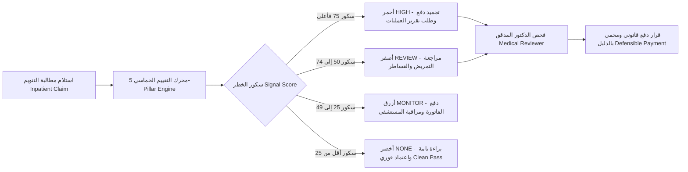

# 🏥 نظام إشارة الـ HAC ومحرك الـ POA لكشف مضاعفات المستشفيات
### دليل الديمو التنفيذي وسيناريو الاجتماع بلهجة حقيقية ومباشرة بدون بصمة الذكاء الاصطناعي

> **الروابط والبيئات الحية الشغالة حالياً:**
> * 🌐 **الواجهة الأمامية (Vercel):** [https://poa-hac-ui.vercel.app](https://poa-hac-ui.vercel.app)
> * ⚙️ **سيرفر الباك إند والحسابات (Render API):** [https://poa-hac-backend.onrender.com/api](https://poa-hac-backend.onrender.com/api)
> * 📊 **طابور المطالبات الحي (Review Queue):** [https://poa-hac-ui.vercel.app/claims](https://poa-hac-ui.vercel.app/claims)
> * 📈 **شاشة تحليلات المستشفيات (Population Analytics):** [https://poa-hac-ui.vercel.app/analytics](https://poa-hac-ui.vercel.app/analytics)
> * 🌐 **النسخة الإنجليزية (English Edition):** [HAC_SIGNAL_DEMO_GUIDE.md](file:///Users/z4dev/Desktop/root/Currently%20Working%20on/Kayan/poa-hac-ui/HAC_SIGNAL_DEMO_GUIDE.md)

---

## 📑 فهرس المحاور السريع
1. [شو تحكي بالديمو؟ (القاموس السريع ومصفوفة الكلمات المفتاحية)](#0-شو-تحكي-بالديمو-القاموس-السريع-ومصفوفة-الكلمات-المفتاحية)
2. [شو المشكلة؟ وليش التأمين محتاج هالسيستم؟ (القيمة الحقيقية)](#1-شو-المشكلة-وليش-التأمين-محتاج-هالسيستم-القيمة-الحقيقية)
3. [شو الفرق الجوهري بين الـ HAC والـ POA؟](#2-شو-الفرق-الجوهري-بين-الـ-hac-والـ-poa)
4. [القاعدة الذهبية: الذكاء الاصطناعي ما برفض لحاله (Human Review)](#3-القاعدة-الذهبية-الذكاء-الاصطناعي-ما-برفض-لحاله-human-review)
5. [كيف بنحسب السكور من 0 لـ 100؟ (محاور التقييم الخمسة)](#4-كيف-بنحسب-السكور-من-0-لـ-100-محاور-التقييم-الخمسة)
6. [أسقف العدالة (عشان ما نظلم المستشفيات Fairness Caps)](#5-أسقف-العدالة-عشان-ما-نظلم-المستشفيات-fairness-caps)
7. [تصنيف درجات الخطر بالسيستم (Signal Priority Levels)](#6-تصنيف-درجات-الخطر-بالسيستم-signal-priority-levels)
8. [الحالات الخمسة الحية المجهزة للديمو (Live Demo Cases)](#7-الحالات-الخمسة-الحية-المجهزة-للديمو-live-demo-cases)
9. [سيناريو العرض في 5 دقائق (شو تحكي بالضبط بالاجتماع)](#8-سيناريو-العرض-في-5-دقائق-شو-تحكي-بالضبط-بالاجتماع)
10. [كيف مبني السيستم سحابياً؟ (Tech Stack والعمارة الفنية)](#9-كيف-مبني-السيستم-سحابيا-tech-stack-والعمارة-الفنية)

---

## ٠. شو تحكي بالديمو؟ (القاموس السريع ومصفوفة الكلمات المفتاحية)

| المصطلح الإنجليزي (Keyword) | شو يعني بالبلدي؟ | كيف تحكيه بالديمو؟ |
| :--- | :--- | :--- |
| **HAC (Hospital-Acquired Complications)** | **مضاعفة صارت جوّا المستشفى** | مريض دخل يعمل عملية، لقط بكتيريا أو التهب جرحه أو طلعتله قرحة بعد كم يوم. هون الغلط من المستشفى والتأمين المفروض ما يدفع تكلفة تصليح هالغلط. |
| **POA (Present On Admission)** | **المريض أصلاً كان جاي فيها** | مريض عمل حادث واجا عالطوارئ ومعه قرحة بجلده من زمان. فحص الطوارئ بالساعة 0.0 وثّق هالشي. هون المستشفى بريء 100% والمطالبة بتنصرف كاملة بدون خصم. |
| **Review Queue** | **طابور الفرز والتدقيق الذكي** | الشاشة اللي بتفرزلك كل المطالبات حسب درجة الخطر (أحمر، أصفر، أخضر)؛ عشان المراجع يركز عالحالات الخطيرة وما يضيع وقته بالحالات النظيفة. |
| **Return to Theatre** | **رجعة طارئة لغرفة العمليات** | الجراح اضطر يرجع يفتح بطن المريض مرة تانية عشان ينظف صديد أو يوقف نزيف مفاجئ بعد العملية. هاي لحالها بتاخد أعلى علامة خطر بالسيستم (25 نقطة). |
| **Rescue Interventions & Drugs** | **تدخلات وترياق الإنقاذ الحرج** | لما يبلشوا يحولوا المريض عالعناية المركزة ICU ويعطوه مضادات قوية زي الفانكومايسين (Vancomycin) أو مميعات وريدية عشان يلحقوه قبل ما يتدهور. |
| **Evidence Story** | **ملف وقصة الإثبات الرقمي** | كروت المحاور الخمسة (A إلى E) اللي بتشرح للدكتور المراجع بالدقيقة والتفصيل ليش السيستم طلع هاد السكور ومين المسؤول. |
| **Fairness Caps** | **أسقف العدالة (عشان ما نظلم حدا)** | صمامات أمان بالمعادلة بتمنع معاقبة المستشفى إذا كان المريض أصلاً وضعه ميؤوس منه وطبيعي يتدهور (سقف 30)، أو إذا المريض كان متحول من مستشفى تاني خربان وضعه عنده (سقف 15). |
| **Audit Trail & SHA-256** | **بصمة التوثيق المشفرة للقرار** | كل حركة ونوتة بيكتبها الدكتور بتتسجل بتوقيع رقمي وتاريخ بالثانية، عشان لو صار أي نزاع أو اعتراض قضائي من المستشفى، يكون حق التأمين محمي قانونياً بالدليل. |
| **Population Analytics** | **شاشة المقارنة ومراقبة المستشفيات** | داشبورد بتفرجيك مين أكتر مستشفيات عم بتصير عندها مضاعفات، عشان لما تيجي تجدد العقود تكون عارف شو عم بصير على أرض الواقع. |
| **Fast-Track Clean Pass** | **المسار السريع للاعتماد الفوري** | حالة الـ POA المؤكدة (سكور أقل من 25) بتمر فورا للموافقة والدفع، بدون ما دكتور يضيع وقته بمراجعتها. |

---

## ١. شو المشكلة؟ وليش التأمين محتاج هالسيستم؟ (القيمة الحقيقية)

في قطاع التأمين الصحي (سواء منصة ضماني **Dhamani** أو شركات الـ **TPA**)، في فلوس كتيرة عم بتضيع بدون داعي:
* **فواتير منفوخة بسبب أخطاء المستشفى:** المستشفى بيغلط أو بيهمل، والمريض بتلتهب عمليته وبقعد 5 أيام زيادة بالـ ICU وبياخد أدوية غالية، وبالآخر بيبعتوا الفاتورة الإضافية للتأمين عشان يدفعها!
* **الدكاترة المدققين عم بغرقوا بالورق:** الدكتور المراجع بيقعد نص ساعة يقلّب بملف التمريض عشان يعرف: متى بلشت الحرارة؟ ومتى ركبوا القسطرة؟ وهل القرحة كانت موجودة أول ما دخل؟ السيستم بيعمل هاد الحكي بـ **30 ثانية** بس.
* **إنهاء وجع الراس والخناقات مع المستشفيات:** لما تخصم عالمستشفى برفعوا اعتراض وبقولوا ظلمتونا. بس لما تطلعله ملف فيه تايم لاين بالدقيقة وكود الـ ICD-10 وتقرير فتح البطن الطارئ، ما بيقدر يناقش وبقبل الخصم وهو ساكت.



---

## ٢. شو الفرق الجوهري بين الـ HAC والـ POA؟

### ١. مشكلة صارت جوّا المستشفى — HAC (Hospital-Acquired Complications)
المريض دخل سليم وما عنده أي مشكلة من هالنوع، وخلال فترة التنويم صار معه إشي بسبب إهمال أو تقصير بنظافة العمليات والتمريض:
* **تلوث والتهاب عميق بجرح العملية (Surgical Site Infection / SSI)** (زي التهاب جرح المرارة أو القيصرية).
* **التهاب مسالك بولية حاد بسبب إهمال قسطرة البول (CAUTI)**.
* **قرحة فراش ما كانت موجودة وطلعت باليوم الرابع (Decubitus Ulcer Stage 2+)**.
* **جلطة بالساق أو الرئة بعد عملية العظام (DVT / PE)**.
* **النتيجة المالية:** التأمين بوقف دفع تكاليف المضاعفة والمستشفى بتحملها لحاله.

### ٢. المريض إجا فيها من الأساس — POA (Present On Admission)
المرض أو الإصابة كانت **موثقة بملف الطوارئ أول ما المريض وصل بالضبط** ($\Delta t = 0.0$ ساعة):
* مريض ختيار وقع وانكسر حوضه، وهو طريح فراش بالبيت وعنده قرحة مصورة بالطوارئ؛ المستشفى ما إله أي ذنب فيها.
* التهاب رئوي كان المريض بعاني منه بالبيت واجا عالمستشفى يتعالج منه.
* **النتيجة المالية:** المستشفى بريء تماماً، والمطالبة بتنصرف كاملة بدون خصم قرش واحد (**Clean Pass**).

---

## ٣. القاعدة الذهبية: الذكاء الاصطناعي ما برفض لحاله (Human Review)

> [!IMPORTANT]
> **قاعدة ما بتتغير بالسيستم:**
> **ممنوع على الذكاء الاصطناعي يرفض أي مطالبة أوتوماتيكياً (No Automatic Denials)**، والإجراء التشغيلي مقيد دائماً بـ `action = HUMAN_REVIEW`.
> 
> قرارات التأمين والطب بتمس فلوس وسمعة مستشفيات وحياة ناس. عشان هيك السيستم ما بستبدل الدكتور البشري، بل بشتغل متل **"مساعد طيار ومحقق ذكي" (Investigative AI Co-Pilot)**؛ بفرز آلاف المطالبات بثواني، بحسب نسبة الشبهة الرياضية، وبجهّز للدكتور ملف أدلة واضح بالدقائق عشان الدكتور يكبس الزر وهو واثق ومرتاح وخلال نص دقيقة بس.

---

## ٤. كيف بنحسب السكور من 0 لـ 100؟ (محاور التقييم الخمسة)

السكور النهائي بنحسب من جمع 5 محاور مستقلة (مع مراعاة أسقف العدالة):

$$\text{Final Score} = \text{Comp A} + \text{Comp B} + \text{Comp C} + \text{Comp D} + \text{Comp E} \quad (\text{خاضع لمحددات العدالة})$$

```
+-------------------------------------------------------------------------------+
|                       محرك إشارة HAC السريري (100 نقطة كحد أقصى)                  |
+---------------------+--------------------+--------------------+---------------+
| المحور A: الترميز (20)| المحور B: التوقيت (20)| المحور C: المسار (20)| المحور D: الإنقاذ| المحور E: السجل |
| كود التشخيص معترف؟ | متى رُصدت المضاعفة؟ | مرتبطة بمرض الدخول؟| فتح بطن طارئ وأدوية| نفس المستشفى قديماً|
+---------------------+--------------------+--------------------+---------------+---------------+
```

### المحور A: كود التشخيص نفسه شو معترف؟ (Cause Transparency) — من 0 إلى 20 نقطة
* **A1 (20 نقطة):** كود صريح بعترف إنه صار تلوث بعد عملية جراحية (زي `T81.4` عدوى بعد عملية، `J95.` مشاكل تنفسية بعد الجراحة).
* **A2 (16 نقطة):** كود بذكر جهاز أو قسطرة طبية (زي `T83.5` تلوث قسطرة البول، `T84.` تلوث مفاصل صناعية).
* **A3 (12 نقطة):** كود بعبر عن مضاعفة غير مباشرة (زي `A41.` تسمم دم جراحي، `K65.` التهاب الصفاق).
* **A4 (10 نقطة):** حدث حاد بستدعي إشي خارجي صار معه (زي `D62` نزيف حاد بعد جراحة، `S-codes` الوقوع جوّا الغرفة).
* **A5 (6 نقاط):** كود عام موجود بقائمة الرقابة المشددة (زي `L89.` قرح الفراش، `I26.` جلطة الرئة).
* **A6 (0 نقطة):** أمراض عادية ومزمنة ما إلها علاقة بالجراحة.

### المحور B: فرق التوقيت واستنتاج الدخول (In-Stay Timing / POA) — من 0 إلى 20 نقطة
*السيستم بطرح تاريخ أول رصد للمضاعفة من تاريخ دخول المستشفى ($\Delta t$):*
* **B1 (بعد 48 ساعة أو أكتر) = 20 نقطة:** دليل قاطع إنها لقطتها جوّا التنويم وتجاوزت فترة الحضانة القياسية.
* **B2 (بين 24 و 48 ساعة) = 12 نقطة:** مؤشر متوسط بستدعي مراجعة التمريض.
* **B3 (أول 24 ساعة) = 6 نقاط:** فترة مبكرة بترجح إنه كان بحضن المرض من البيت.
* **B4 (الساعة صفر لحظة الاستقبال) = 0 نقطة:** **إثبات POA قاطع وبراءة تامة**.

### المحور C: الارتباط بمرض الدخول (Clinical Relatedness) — من 0 إلى 20 نقطة
*هل هالمضاعفة متوقعة من نفس المرض اللي دخل عشانه المريض ولا فجأة طلعت؟*
* **واقعية ومنطق:** طالما لسه ما ربطنا مودل ذكاء اصطناعي طبي معتمد، السيستم ما بفتي من عنده؛ برجع `UNKNOWN` مع علامة وسطية عادلة (**10 نقاط**) وتنبيه رقابي عشان الدكتور المراجع ما يعتبر "غير معروف" كأنه "غير مرتبط".

### المحور D: سلم العمليات الطارئة وأدوية الإنقاذ (Intervention Ladder) — من 0 إلى 25 نقطة
*شو اضطروا يعملوا عشان ينقذوا المريض؟*
* **الرجوع الطارئ لغرفة العمليات (Return to Theatre) = 25 نقطة:** فتح الشق الجراحي من جديد، تنظيف الصديد، رتق الأنسجة.
* **إنقاذ فائق الخطورة (High-Acuity Rescue) = 20 نقطة:** تحويل للعناية المركزة ICU، أجهزة تنفس صناعي، غسيل كلوي طارئ.
* **عملية تانية غير مجدولة = 14 نقطة.**
* **فحوصات وأشعة استقصائية طارئة = 8 نقاط:** أشعة مقطعية للصدر CTPA، مناظير استكشافية.
* **معززات تراكمية (سقف المحور 25 نقطة):** أدوية وترياق إنقاذ كالفانكومايسين ومميعات الوريد (+3 نقاط)، إجراء بدون موافقة مسبقة (+3 نقاط).

### المحور E: سجل المستشفى آخر 90 يوم (Longitudinal Lookback) — من 0 إلى 15 نقطة
*فحص سجل مطالبات المريض القديمة بقاعدة بيانات التأمين:*
* **نفس المستشفى خلال آخر 30 يوم = 15 نقطة:** تحميل المستشفى المسؤولية كاملة لوجود جراحة سابقة مرتبطة بالمشكلة.
* **نفس المستشفى بين 31 و 90 يوم = 9 نقاط:** مسؤولية جزئية لمضاعفات متأخرة.
* **مستشفى مختلف = 3 نقاط:** الشبهة بتروح عالمستشفى القديم اللي عمل العملية حماية للمستشفى الحالي.
* **سجل نظيف = 0 نقطة.**

---

## ٥. أسقف العدالة (عشان ما نظلم المستشفيات Fairness Caps)

صمامات أمان ذكية بالمعادلة بتمنع الخصم الظالم بالحالات المعقدة أو المحولة:
1. **سقف التدهور الحتمي (Progression Cap $\le 30$ نقطة):** لو كان المريض أصلاً وضعه ميؤوس منه وطبيعي حالته تتدهور (متل حالات الرعاية التلطيفية Palliative Care أو فشل الأعضاء المتعدد)، المستشفى مو ذنبه إنه المريض عم بضعف. هون السيستم بقفل السكور تلقائياً عند **30 نقطة فقط** وبمنع أي خصم ظالم.
2. **سقف المريض المحول من مستشفى تاني (Different Provider Cap $\le 15$ نقطة):** لو استقبلت مريض خربان وضعه وجاي بتسمم من عملية انعملتله بمستشفى تاني، المستشفى اللي استقبله عشان ينقذه ما بياكل المخالفة! السكور عنده **ما بتعدى 15 نقطة**، وملف التدقيق بتحول للمستشفى الأولاني اللي عمل العملية.

---

## ٦. تصنيف درجات الخطر بالسيستم (Signal Priority Levels)

| المستوى | نطاق السكور | شو لونه بالشاشة؟ | شو لازم يعمل الدكتور المدقق؟ |
| :---: | :---: | :---: | :--- |
| **`HIGH`** | **$75 - 100$** | أحمر فاقع | وقف صرف بند المضاعفة فوراً واطلب تقرير الجراح وسجلات مكافحة العدوى. |
| **`REVIEW`** | **$50 - 74$** | أصفر | راجع سجلات التمريض ومذكرات تركيب القساطر والمزارع البكتيرية قبل ما تدفع. |
| **`MONITOR`**| **$25 - 49$** | أزرق | ادفع الفاتورة بس حط المستشفى تحت عين المراقبة الإشرافية عشان ما تتكرر. |
| **`NONE`** | **$< 25$** | أخضر براءة | براءة تامة. إثبات الـ POA موجود بالساعة صفر؛ مرر المطالبة فورا للاعتماد والدفع. |

---

## ٧. الحالات الخمسة الحية المجهزة للديمو (Live Demo Cases)

| رقم المطالبة (Claim ID) | المريض | المستشفى | شو المشكلة المشتبه فيها؟ | السكور | اللون | الحالة |
| :--- | :---: | :--- | :--- | :---: | :---: | :---: |
| [**`CLM-2026-0841`**](https://poa-hac-ui.vercel.app/claims/CLM-2026-0841) | 58 أنثى | مستشفى مسقط العام | التهاب عميق بجرح المرارة (`T81.4XXA`) + تسمم دم (`A41.9`) | **90** | **`HIGH`** | `NEW` |
| [**`CLM-2026-1123`**](https://poa-hac-ui.vercel.app/claims/CLM-2026-1123) | 69 ذكر | مركز صلالة للرعاية الطبية | التهاب مسالك بولية حاد بسبب قسطرة البول CAUTI (`T83.511A`) | **69** | **`REVIEW`** | `IN_REVIEW` |
| [**`CLM-2026-2049`**](https://poa-hac-ui.vercel.app/claims/CLM-2026-2049) | 76 أنثى | مستشفى نزوى المرجعي | قرحة فراش عجزية من الدرجة التانية ظهرت باليوم الرابع (`L89.152`) | **55** | **`REVIEW`** | `MONITORING` |
| [**`CLM-2026-4401`**](https://poa-hac-ui.vercel.app/claims/CLM-2026-4401) | 64 أنثى | مدينة السلطان قابوس الطبية | جلطة بالرئة (PE) بعد عملية تبديل مفصل الورك (`I26.99`) | **53** | **`REVIEW`** | `IN_REVIEW` |
| [**`CLM-2026-3392`**](https://poa-hac-ui.vercel.app/claims/CLM-2026-3392) | 71 ذكر | مجمع صحار الطبي | قرحة فراش موثقة بالساعة صفر بالطوارئ POA مؤكد (`L89.311`) | **10** | **`NONE`** | `RESOLVED` |

---

## ٨. سيناريو العرض في 5 دقائق (شو تحكي بالضبط بالاجتماع)

### الدقيقة 0:00 – 1:00: المقدمة والوجع الحقيقي (The Problem & The Hook)
> *"يسعد أوقاتكم جميعاً. اليوم رح نفرجيكم حل لمشكلة بتكلف شركات التأمين ملايين كل سنة: المستشفيات عم بصير عندها أخطاء ومضاعفات جوّا التنويم — متل التهابات الجروح وتلوث القساطر — وبيرجعوا يفوتروا أيام العناية المركزة والعمليات التصحيحية عالتأمين! وبنفس الوقت، التأمين دايماً بخاف يظلم المستشفى إذا كان المريض أصلاً جاي ومعه المشكلة من البيت (POA).*
> 
> *اليوم بنقدملكم منصة **HAC Signal** — سيستم ذكي بحلل المطالبات بثواني، بحسب سكور موضوعي من 0 لـ 100 بناءً على 5 محاور، وبعطي الدكتور المدقق دليل زمني قاطع يحميه قانونياً وبوفر ملايين الهدر."*

### الدقيقة 1:00 – 2:00: شاشة الفرز الحية (Review Queue & Triage)
* **افتح الشاشة قدامهم:** [poa-hac-ui.vercel.app/claims](https://poa-hac-ui.vercel.app/claims)
> *"شايفين معي هاي الشاشة؟ هاد هو طابور الفرز الحي **Review Queue**. أول ما توصل مطالبات التنويم، السيستم فوراً بصنفها: حالات حمراء خطيرة **HIGH** بدها تدخل سريع وتجميد دفع، وحالات صفراء **REVIEW** لمراجعة التمريض، وحالات خضراء **NONE** ثبت بالدليل إنها جاية من البيت **POA** فبتنصرف فورا. هيك لغينا أكتر من 80% من وجع الراس والتدقيق اليدوي اللي ما إله طعمة."*

### الدقيقة 2:00 – 3:30: تشريح الحالة الأخطر (Case CLM-2026-0841)
* **اضغط عالمطالبة:** [CLM-2026-0841 (Score 90 / HIGH)](https://poa-hac-ui.vercel.app/claims/CLM-2026-0841)
> *"تعالوا شوفوا معي هالحالة شو صار فيها: مريضة دخلت تعمل عملية استئصال مرارة عادية. بعد 75 ساعة من العملية، انفجر الجرح بتلوث بكتيري وتسمم دم حاد **Sepsis**، والجراح اضطر ياخدها طوارئ ويرجع يفتح بطنها وينظف الصديد **Return to Theatre** ويعطيها فانكومايسين.*
> 
> *السيستم هون شو عمل؟ أعطاها 20/20 بالتوقيت **Component B** لأنها ظهرت بعد 75 ساعة (تجاوزت فترة الحضانة)، وأعطاها 25/25 بالتدخل الجراحي وأدوية الإنقاذ **Component D: Rescue Drugs**، وأعطاها 15/15 لوجود عملية سابقة بنفس المستشفى قبل 18 يوم **Component E**. يعني الدكتور المراجع قدامه ملف جريمة طبية موثق بالدقيقة **Evidence Story** ما بيقدر المستشفى ينكره."*

### الدقيقة 3:30 – 4:15: القرار البشري والبصمة المشفرة (Human Decisioning & Audit Trail)
> *"وهون بنوصل لأهم نقطة: القرار النهائي دايماً للدكتور البشري. بضغط على زر **Review case**، وبختار **CONFIRM_CONCERN** لتأكيد الشبهة، وبكتب إنه تم استقطاع تكلفة إعادة فتح البطن وأيام التنويم الزيادة. وبنفس اللحظة بقدر يكتب نوتة بتتسجل ببصمة وتوقيع إلكتروني مشفر **SHA-256 Audit Trail** عشان لو المستشفى اعترض بالمحكمة، بنطلعله التقرير وهيك حق التأمين محمي 100%."*

### الدقيقة 4:15 – 5:00: الداشبورد ومراقبة أداء المستشفيات (Population Analytics)
* **انتقل لشاشة التحليلات:** [poa-hac-ui.vercel.app/analytics](https://poa-hac-ui.vercel.app/analytics)
> *"بالنهاية، السيستم بعطيك لوحة قيادة كاملة **Population Analytics** تقارن فيها أداء المستشفيات **Provider Benchmarking**؛ بتشوف مثلاً مستشفى مسقط معدل خطورته 90 بينما مجمع صحار معدله 10 بس. هيك إدارة التأمين بتصير تعرف مع مين تجدد عقود، ومين تفرض عليه شروط جودة، وتوقف الهدر قبل ما الفواتير تنبعت أصلاً."*

---

## ٩. كيف مبني السيستم سحابياً؟ (Tech Stack والعمارة الفنية)

```
┌────────────────────────────────────────────────────────┐
│                   متصفح العميل (CLIENT)                 │
│  React 19 SPA + Lucide Icons + Recharts Data Visuals   │
│  (مستضاف على شبكة Vercel: https://poa-hac-ui.vercel.app) │
└──────────────────────────┬─────────────────────────────┘
                           │ HTTPS سريع مع CORS
                           ▼
┌────────────────────────────────────────────────────────┐
│                  سيرفر الباك إند (EXPRESS API)         │
│  TypeScript + Node.js (مستضاف على Render: منفذ 10000)  │
│  - مسارات RESTful (/api/hac/review-queue, etc.)        │
│  - محرك القواعد الرياضية للمحاور الخمسة A to E         │
│  - توليد بصمة التدقيق المشفرة SHA-256 خلال أقل من 50ms │
└──────────────────────────┬─────────────────────────────┘
                           │ قراءة وكتابة ذرية فورية
                           ▼
┌────────────────────────────────────────────────────────┐
│             مخزن الداتا اللحظي المتزامن                 │
│  - server/data/runtime/workflow.json (المطالبات والنوتات)│
│  - server/data/runtime/config.json   (قواعد السكور)     │
│  - كاش محلي بالفرونت إند بحميك لو الباك إند نايم       │
└────────────────────────────────────────────────────────┘
```
